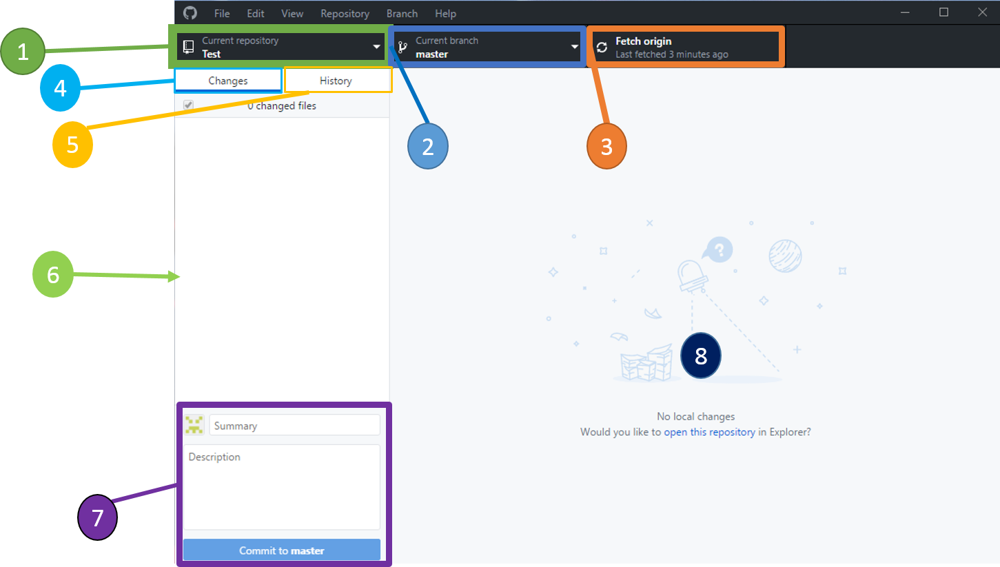
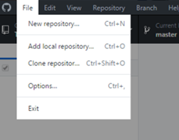
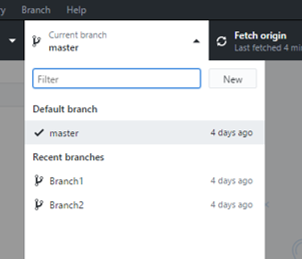
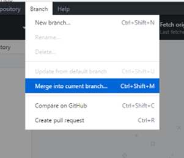
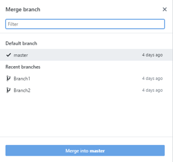

## Ambiente gráfico de Github

A continuación, se presenta una opción que permite el uso de Github de manera sencilla. A través de una interfaz grafica podremos dominar y entender los conceptos del uso de Git y aplicarlos a nuestros proyectos de robótica cuanto antes.

En esta guía se recomienda el uso de [Github Desktop](https://desktop.github.com/), que es el oficial de Github aunque existen varias otras opciones de ambiente gráfico.

### La interfaz

##### 1. Selecciona el repositorio en el que se esta trabajando.
##### 2. Control de branches, selecciona el Branch actual.
##### 3. Control de comandos, cambia según se requiera (Fetch, Pull, Push).
##### 4. Vista de últimos cambios hechos en el Branch actual.
##### 5. Historial del Branch actual. 
##### 6. Listado de cambios.
##### 7. Caja de texto para la descripcion del Commit
##### 8. Detalles de los cambios hecho.

***
### Repositorio nuevo

* **New Repository** Crea un repositorio nuevo local, que después podra hacerse público.
* **Add local repository** Permite visualizar y trabajar con un repositorio local ya existente.
* **Clone a repository** Clona un repositorio remoto haciendo una copia local en la computadora, que podra estarse sincronizando con los cambios que hagamos. 

***
### Branches

Se hace *doble click* para cambiarse de branch (checkout), que será la nueva Branch actual.
**New** permite crear una branch nueva que sera copia de la Branch actual.

***
### Merging

Primero se debe de cambiar al branch donde queremos que estén los cambios nuevos, hacemos checkout con doble click en "Current Branch". Despues vamos a *Branch/Merge into current branch*, y seleccionamos la Branch de donde queremos traer los cambios.
