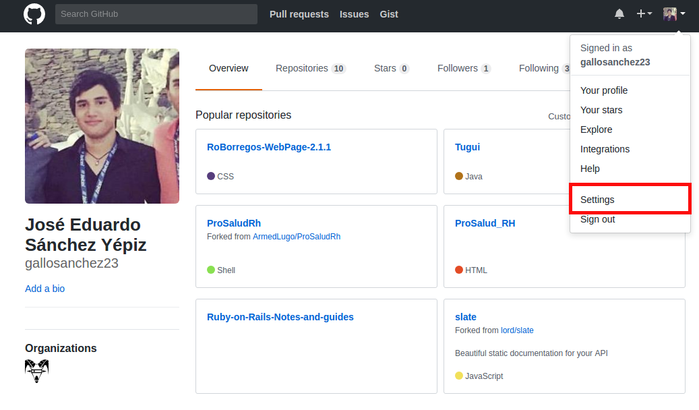
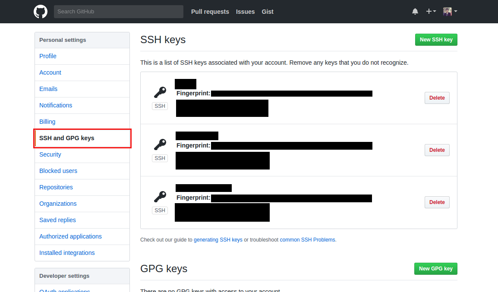
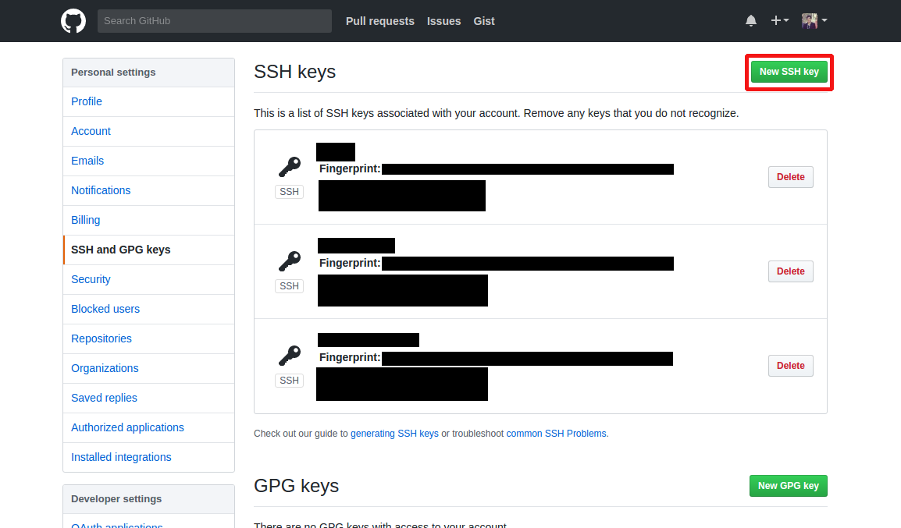
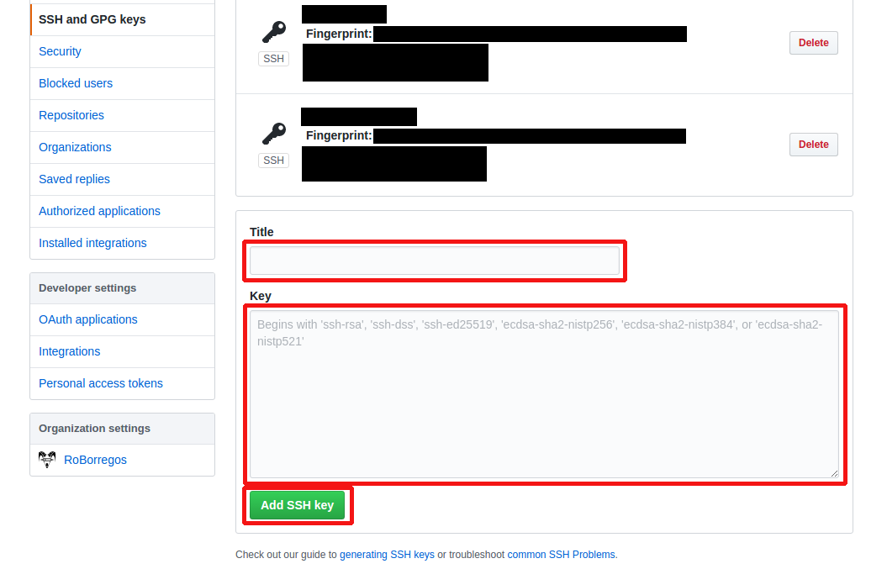

## Creación y configuración de usuario.

El primer paso será crear una cuenta personal en github. Una vez que se ha creado una seguirá el paso de la configuración
de nuestra cuenta con las credenciales o llaves necesarias para poder colaborar en un proyecto en equipo, para lo cual
seleccionaremos la opción **Settings** dentro del dropdown ubicado en la esquina superior derecha:

Posteriormente, dentro del menú de opciones ubicado del lado izquierdo de la pantalla, daremos click en la opción **SSH and
GPG keys**:

Dentro de esta pantalla selecciona la opción de **New SSH key**:

Los pasos que debemos seguir para obtener la llave SSH de nuestro ordenador actual los podrás encontrar en el artículo
**[Generating a new SSH key and adding it to the ssh-agent](https://help.github.com/articles/generating-a-new-ssh-key-and-adding-it-to-the-ssh-agent/)**.

Una vez generada la llave SSH le daremos un nombre en el campo de **Title** y pegaremos la llave dentro del campo **Key**.
Finalmente selecciona la opción de **Add SSH key**.

